#Tourapp

Aplicación Android para turismo en la Comunidad de Madrid.

##Objetivo

El objetivo de estra aplicación ha sido desarrollar una aplicación móvil para Android que permita al usuario compratir con otras personas los lugares que considere interesantes pero que no tengan que ser necesariamente famosos o aparecer en la guías turísticas. De esta forma se puede proponer una forma de turismo 
diferente.

##Características de la aplicación

- Uso de cuenta (Login).
- Perfil de lugares de interés.
- Listas de lugares.
- Comentarios.

###Cuenta aplicación

El usuario para poder acceder a todas la funcionalidades de la aplicación requiere hacerse una cuenta en la aplicación de Tourapp. Aunque es posible acceder a
los servicios de forma parcial sin la misma. 

<em>*El usuario sin cuenta tendrá ver la capacidad de filtrar las listas de lugares en funcióna la categoría de los mismos y su puntuación y ver la
información disponible de los lugares, pero no le será posible hacer uso de las demás funcionalidades.</em>

También si lo desea puede dar de baja su cuenta.

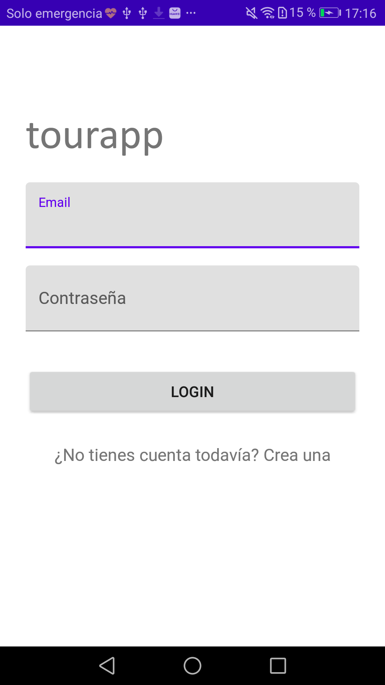
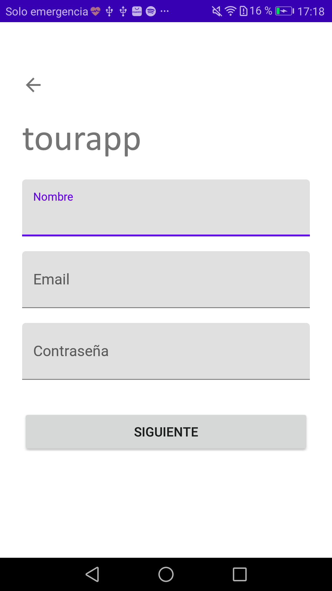

###Perfil de lugares

Se muestra la información de los lugares dados de alta en la aplicación (imágenes, información, localización...).

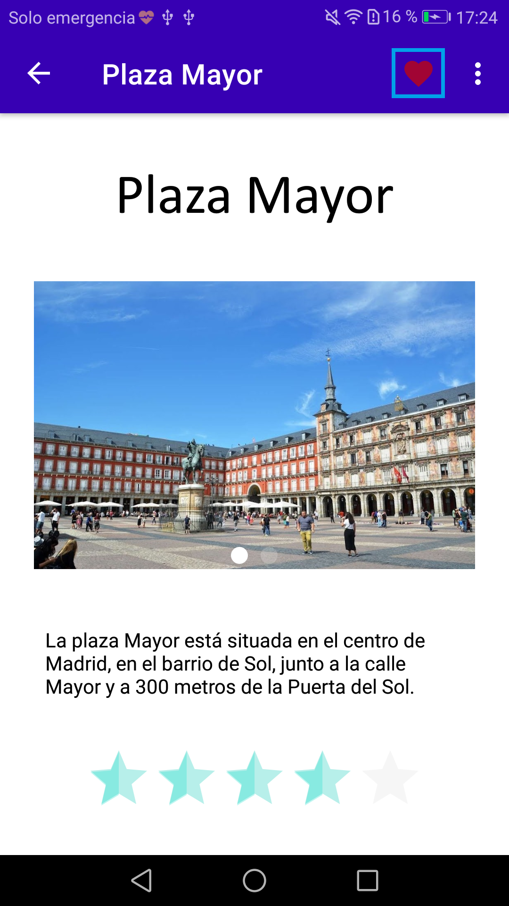
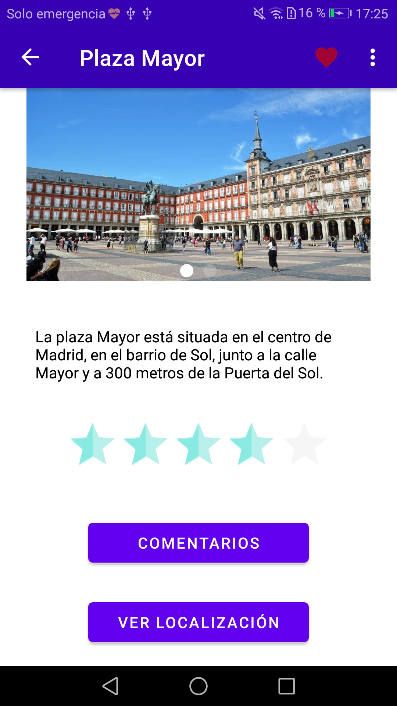

###Listas de lugares

Los disitintos lugares se muestran al usuario en formato de listas, las cuales se pueden filtrar por distintos criterios (categorías, puntuación del lugar, preferencias del usuario...).
Las categorías son: museos, parques, lugares históricos, restaurantes, etc.

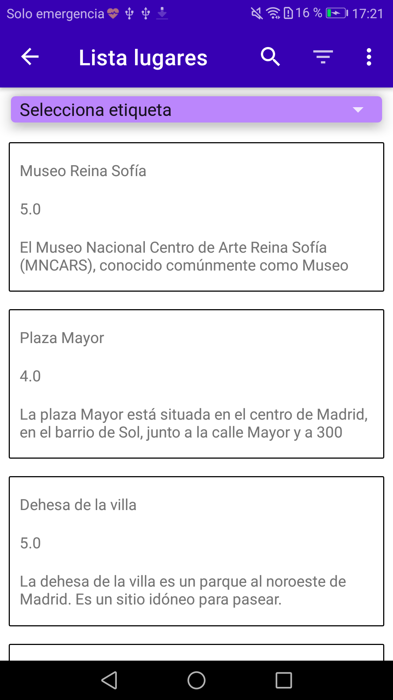
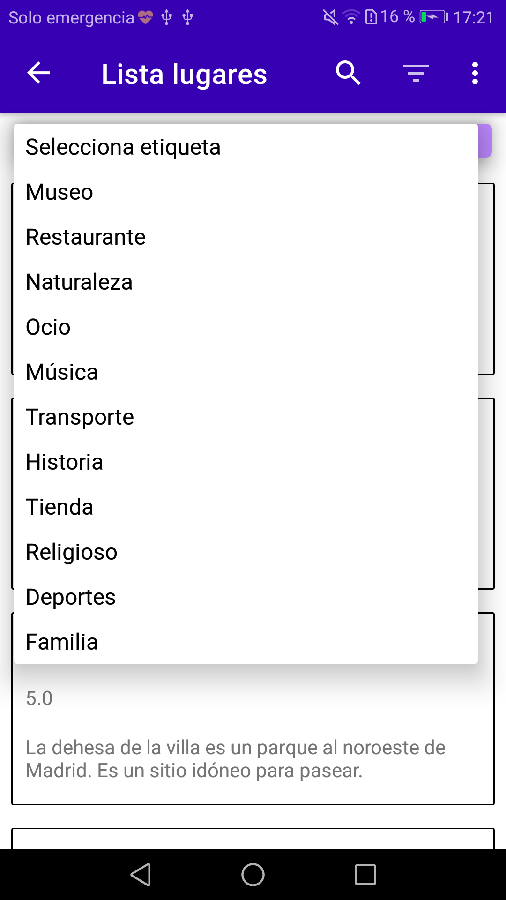
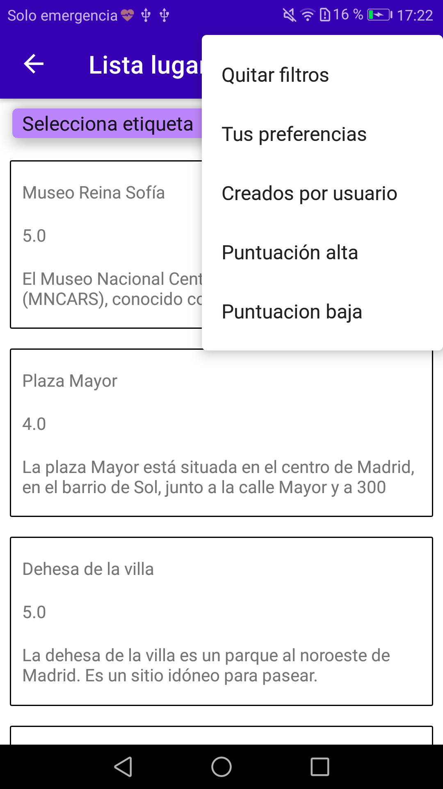

####Listas personales

Es posible para cada usuario crear, editar o eliminar sus propias listas personalizadas.

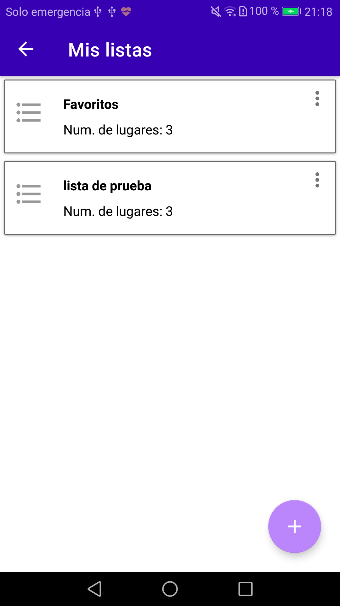
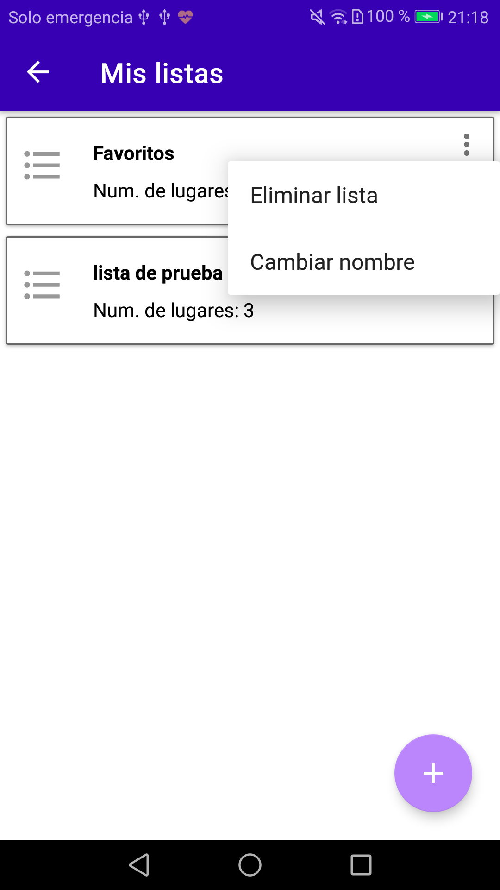
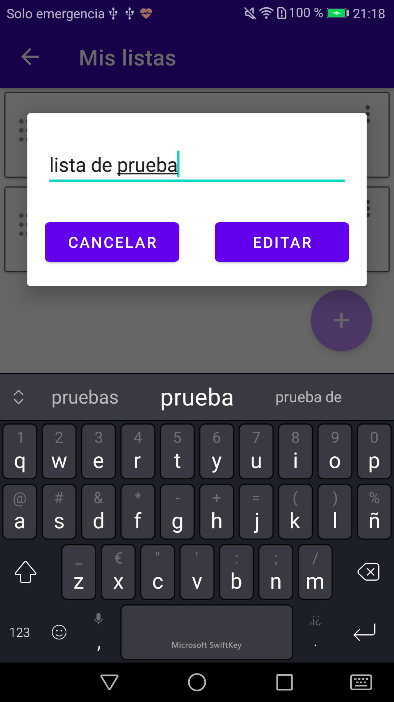

###Comentarios de usuarios

El perfil de cada lugar tiene una sección de comentarios para que cada usuario pueda compartir su opinión con los demás.

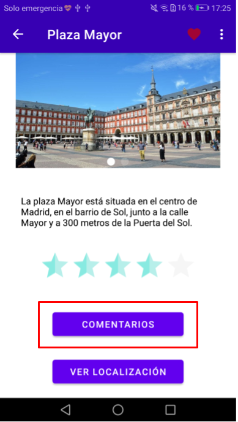
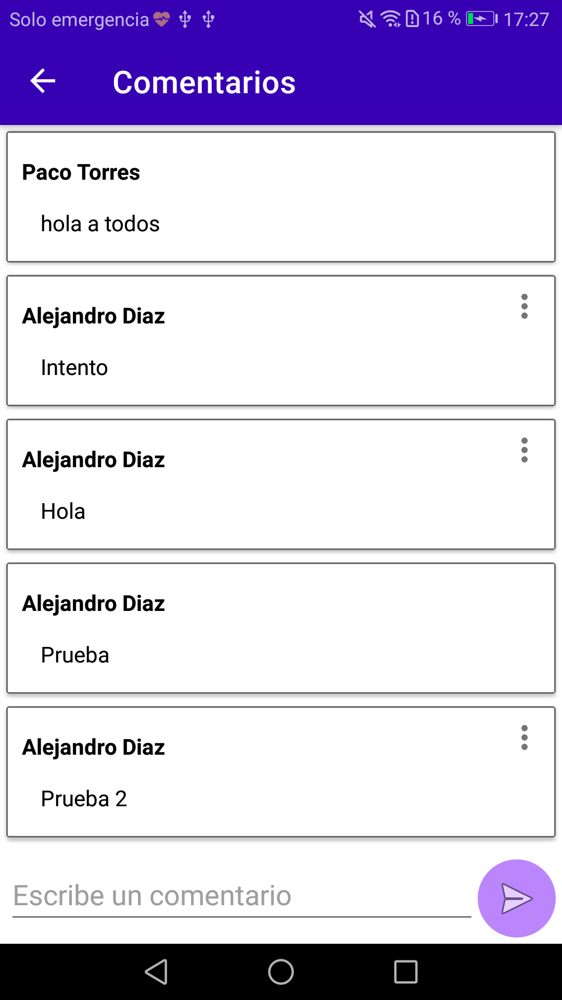

##Especificaciones aplicación

La aplicación funciona en cualquier smartphone o tablet que tenga Android 7.x o superior además de requerir conexión a internet.

